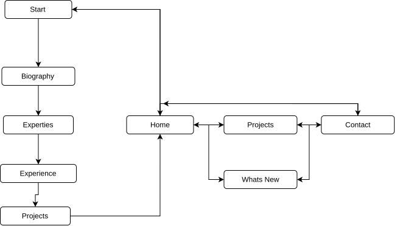

# potential-journey
Potential Journey is the portfolio website for myself. It should highlight myself as a prospective employee and individual as well as my skillsets, experience and projects. This will also be my learning opurtunity into UI/UX development.

# Initial User Flow Diagram

This diagram illustrates the initial user flow for the portfolio website. The design guides visitors through a curated introduction, presenting key information about my background, skills, and experience. After this guided overview, users are seamlessly transitioned into the main site, where they are free to explore projects, achievements, and additional content at their own pace.

## Initial Themes
Light Mode:
--text: #0d0d16;
--background: #f4f4fa;
--primary: #5e4cc8;
--secondary: #8f80e5;
--accent: #6953ea;

---
Dark Mode:
--text: #e9e9f2;
--background: #05050a;
--primary: #4a37b3;
--secondary: #291a7f;
--accent: #2c15ac;

---

@import url('https://fonts.googleapis.com/css?family=Commissioner:700|Commissioner:400');

body {
  font-family: 'Commissioner';
  font-weight: 400;
}

h1, h2, h3, h4, h5 {
  font-family: 'Commissioner';
  font-weight: 700;
}

html {font-size: 100%;} /* 16px */

h1 {font-size: 4.210rem; /* 67.36px */}

h2 {font-size: 3.158rem; /* 50.56px */}

h3 {font-size: 2.369rem; /* 37.92px */}

h4 {font-size: 1.777rem; /* 28.48px */}

h5 {font-size: 1.333rem; /* 21.28px */}

small {font-size: 0.750rem; /* 12px */}
---

## ✨ About This Portfolio

Welcome to my personal portfolio, **Potential Journey**. This site is crafted to showcase my professional journey, technical expertise, and creative projects. It also serves as a platform to demonstrate my growth and learning in UI/UX development.

---

## 🚀 Features

- **Interactive User Flow:** Engaging introduction to highlight core competencies.
- **Project Gallery:** Detailed case studies and project highlights.
- **Responsive Design:** Optimized for all devices and screen sizes.
- **Modern UI/UX:** Clean, intuitive, and accessible interface.

---

## 📈 Goals

- Present myself as a strong candidate for prospective employers.
- Demonstrate my skills in web development and design.
- Provide an engaging and informative user experience.

---

Thank you for visiting! Feel free to explore and connect.