> **Samvit Prakash.** BSc Honours Computer Science student at the University of Pretoria and aspiring full-stack developer with a strong pull toward back-end engineering. I like taking things apart to understand them — whether that's a web stack, a Linux desktop, or a security control — and rebuilding them cleaner. Currently splitting time between coursework, tutoring, and side projects that usually start with "how hard could this be?"

 

> I graduated with a **BSc in Computer Science** from the University of Pretoria and am now completing my **BSc Honours**. Alongside my studies I work as a **Lecturer's Assistant / Tutor**, breaking down Programming Languages, Data Structures, and Imperative Programming for undergrads — which has probably made me a better communicator than most of my code comments suggest.

> I see myself as a designer, creator, and lifelong learner. My main interest is **back-end and full-stack development**, but I spend a healthy amount of time in **cybersecurity** and **Linux systems tinkering** — [Direwolf](https://github.com/SamvitPrakash/Direwolf), my custom Wayland/Hyprland desktop shell, is where most of that energy goes when I'm not shipping features for clients or coursework.

<!-- | | |
| --- | --- |
| 🎓 | BSc Honours in Computer Science, University of Pretoria — *in progress, 2026* |
| 💼 | Lecturer's Assistant / Tutor, University of Pretoria |
| 🛠️ | Back-end leaning full-stack developer |
| 🌱 | Currently exploring cybersecurity and desktop shell engineering |
| 🏆 | Best Agile Methodology prize (sponsored by Agile Bridge) — Green-Cart, final year capstone | -->

 

**Languages**

**Frameworks & Libraries**

**Databases**

**Operating Systems**

**Other Technologies**

 

| Role | Organisation | Duration | Focus |
| --- | --- | --- | --- |
| Lecturer's Assistant / Tutor | University of Pretoria | Feb 2026 – May 2026 | Tutored Programming Languages; feedback on practicals and semester tests |
| Lecturer's Assistant / Tutor | University of Pretoria | Feb 2026 – May 2026 | Tutored Data Structures; invigilated practicals, resolved technical issues |
| Lecturer's Assistant / Tutor | University of Pretoria | Feb 2024 – Jul 2024 | Tutored Imperative Programming; configured dev environments, debugging support |
| Junior Developer / Team Lead | RHA (commissioned by RHAP) | Jan 2024 – Nov 2024 | Led a team of 4 building a rural health advocacy website — CMS, info posting, infrastructure mapping |
| Job Shadow | SFY | Jan 2023 | Agile/Scrum stand-ups, defect diagnosis, exposure to testing workflows |

 

<table>
<tr>
<td width="33%" valign="top">

**[Direwolf](https://github.com/SamvitPrakash/Direwolf)**

Custom Linux desktop shell built on Wayland and Hyprland, focused on a clean, highly integrated desktop experience.

</td>
<td width="33%" valign="top">

**[Aurora](https://github.com/SamvitPrakash/Aurora)**

Cross-platform mobile weather app built with React Native and Expo, created to sharpen my UI/UX skills.

</td>
<td width="33%" valign="top">

**[Green-Cart](https://github.com/COS301-SE-2025/Green-Cart)**

Eco-friendly e-commerce platform built by a team of 5 as our final year capstone. Won the **Best Agile Methodology** prize sponsored by Agile Bridge.

</td>
</tr>
</table>

 

 

 

| Where | Link |
| --- | --- |
| ✉️ Email | [samvitprakash2004@gmail.com](mailto:samvitprakash2004@gmail.com) |
| 💼 LinkedIn | [in/samvit-prakash-4b8546298](https://www.linkedin.com/in/samvit-prakash-4b8546298/) |
| 🐙 GitHub | [@SamvitPrakash](https://github.com/SamvitPrakash) |
| 📍 Location | Hatfield, Pretoria, South Africa |

